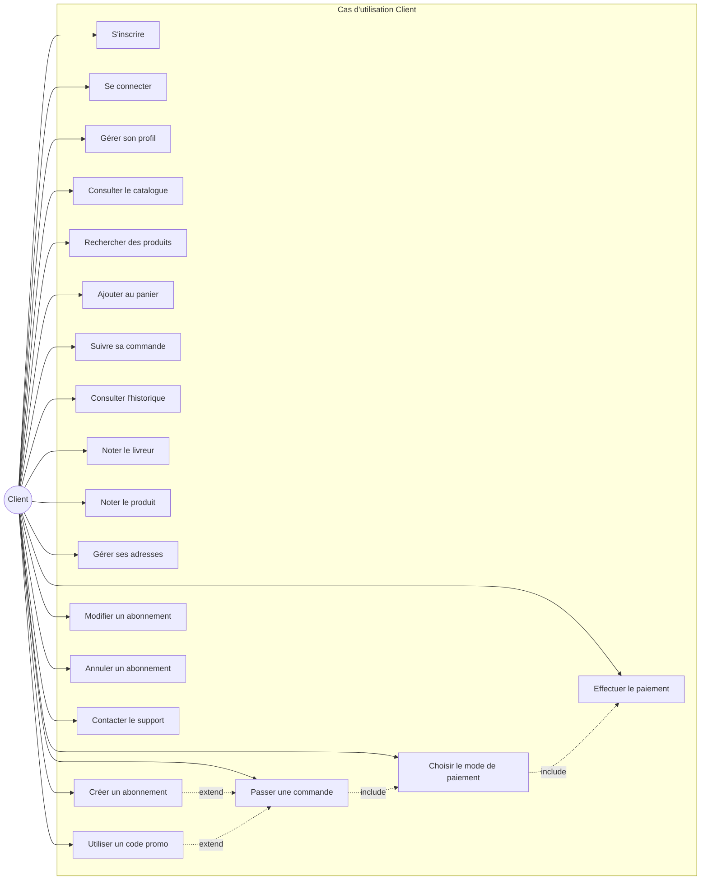
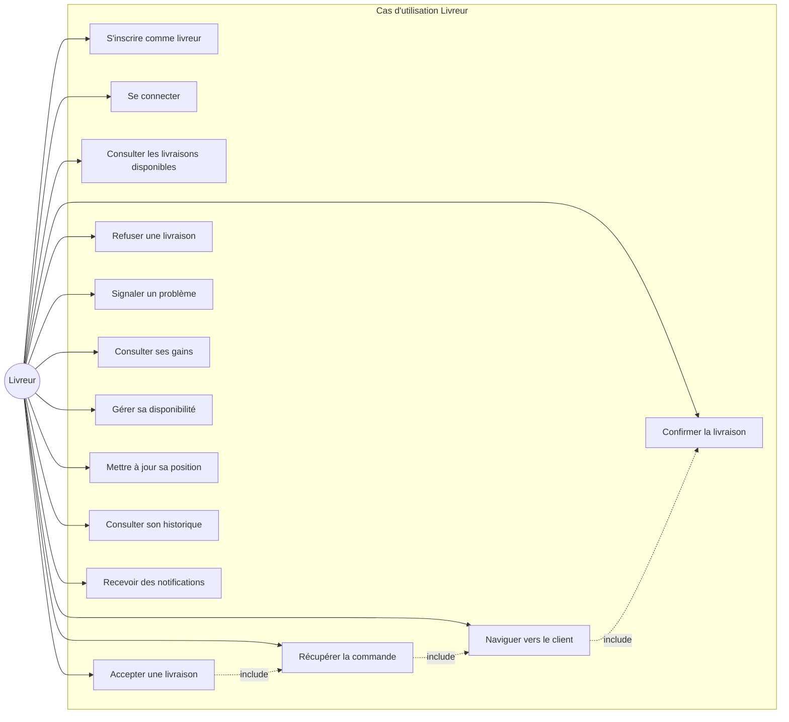
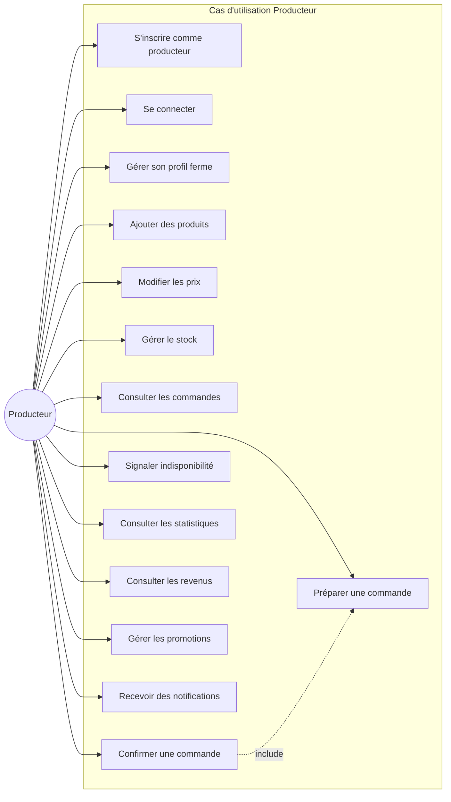
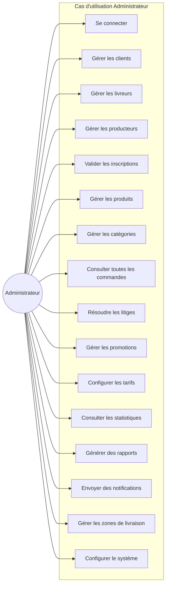
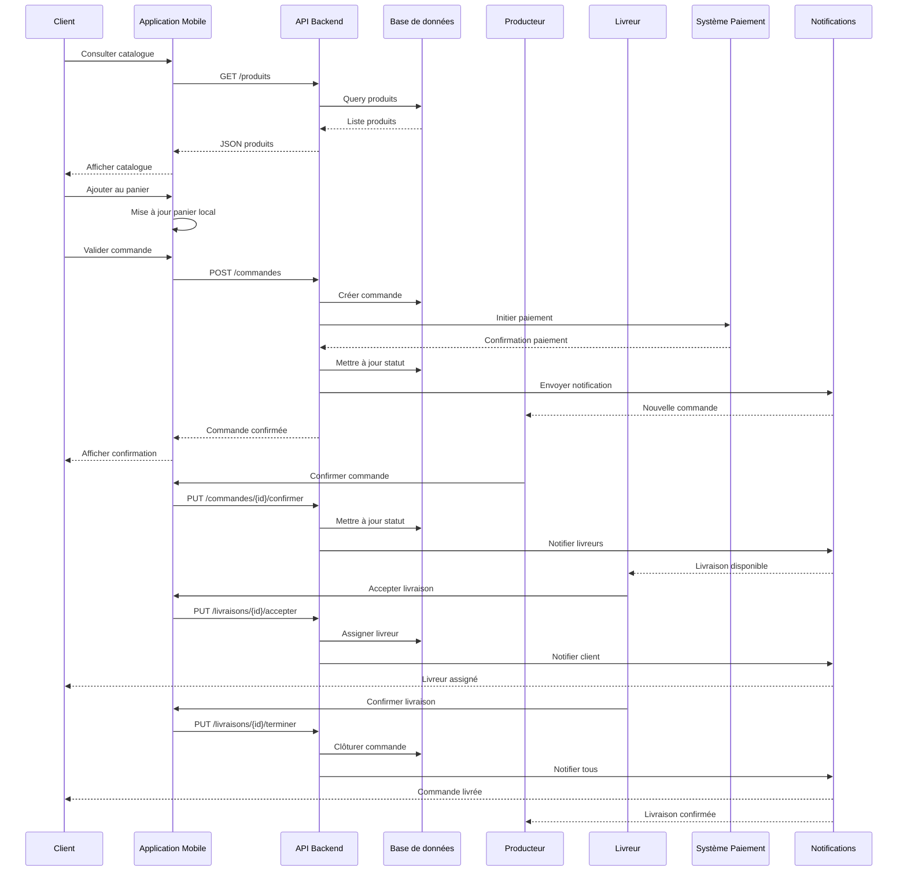
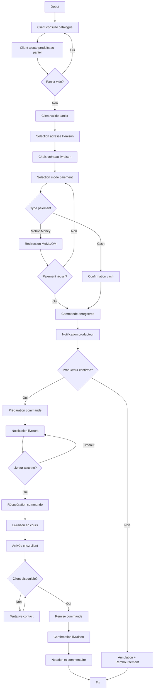

# Description Dynamique - Diagrammes de Cas d'Utilisation

## 1. Introduction

Ce document présente la modélisation dynamique du système EggGo à travers les diagrammes de cas d'utilisation UML. Ces diagrammes décrivent les interactions entre les différents acteurs et le système.

---

## 2. Identification des Acteurs

### 2.1 Acteurs Principaux

| Acteur | Description | Type |
|--------|-------------|------|
| **Client** | Utilisateur final qui commande des œufs | Principal |
| **Livreur** | Personne en charge de la livraison | Principal |
| **Producteur** | Ferme avicole partenaire | Principal |
| **Administrateur** | Gestionnaire de la plateforme | Principal |

### 2.2 Acteurs Secondaires

| Acteur | Description | Type |
|--------|-------------|------|
| **Système de paiement** | MTN MoMo, Orange Money | Secondaire |
| **Système de notification** | Firebase Cloud Messaging | Secondaire |
| **Système de géolocalisation** | Google Maps API | Secondaire |

---

## 3. Diagramme de Cas d'Utilisation Général

```mermaid
graph TB
    subgraph Système EggGo
        UC1[S'inscrire]
        UC2[Se connecter]
        UC3[Gérer son profil]
        UC4[Consulter le catalogue]
        UC5[Passer une commande]
        UC6[Suivre une commande]
        UC7[Effectuer un paiement]
        UC8[Noter et commenter]
        UC9[Gérer les abonnements]
        UC10[Accepter une livraison]
        UC11[Livrer une commande]
        UC12[Mettre à jour le statut]
        UC13[Gérer le stock]
        UC14[Confirmer une commande]
        UC15[Gérer les utilisateurs]
        UC16[Gérer les produits]
        UC17[Consulter les statistiques]
        UC18[Gérer les promotions]
    end

    Client((Client))
    Livreur((Livreur))
    Producteur((Producteur))
    Admin((Administrateur))
    Payment[/Système Paiement/]
    Notif[/Système Notification/]
    Geo[/Système Géolocalisation/]

    Client --> UC1
    Client --> UC2
    Client --> UC3
    Client --> UC4
    Client --> UC5
    Client --> UC6
    Client --> UC7
    Client --> UC8
    Client --> UC9

    Livreur --> UC2
    Livreur --> UC10
    Livreur --> UC11
    Livreur --> UC12

    Producteur --> UC2
    Producteur --> UC13
    Producteur --> UC14

    Admin --> UC2
    Admin --> UC15
    Admin --> UC16
    Admin --> UC17
    Admin --> UC18

    UC5 --> Payment
    UC7 --> Payment
    UC5 --> Notif
    UC6 --> Notif
    UC11 --> Geo
    UC6 --> Geo
```

---

## 4. Cas d'Utilisation Détaillés par Acteur

### 4.1 Cas d'Utilisation - Client

### 4.2 Cas d'Utilisation - Livreur

### 4.3 Cas d'Utilisation - Producteur

### 4.4 Cas d'Utilisation - Administrateur

---

## 5. Description Textuelle des Cas d'Utilisation Principaux

### 5.1 UC: Passer une commande

| Élément | Description |
|---------|-------------|
| **Nom** | Passer une commande |
| **Acteur principal** | Client |
| **Préconditions** | Le client est connecté et a des produits dans son panier |
| **Postconditions** | La commande est enregistrée et le producteur est notifié |
| **Scénario principal** | 1. Le client accède à son panier 2. Le client vérifie les produits 3. Le client sélectionne une adresse de livraison 4. Le client choisit un créneau de livraison 5. Le client sélectionne un mode de paiement 6. Le système calcule le total 7. Le client valide la commande 8. Le système enregistre la commande 9. Le système envoie une notification au producteur |
| **Scénarios alternatifs** | 4a. Le client ajoute une nouvelle adresse 7a. Le paiement échoue → retour à l'étape 5 |
| **Extensions** | Utiliser un code promo, Planifier un abonnement |

### 5.2 UC: Livrer une commande

| Élément | Description |
|---------|-------------|
| **Nom** | Livrer une commande |
| **Acteur principal** | Livreur |
| **Préconditions** | Le livreur a accepté la livraison, la commande est prête |
| **Postconditions** | La commande est livrée et le client est satisfait |
| **Scénario principal** | 1. Le livreur reçoit la notification de commande prête 2. Le livreur se rend chez le producteur 3. Le livreur récupère la commande 4. Le livreur confirme la récupération 5. Le système active la navigation GPS 6. Le livreur se rend chez le client 7. Le livreur remet la commande 8. Le client confirme la réception 9. Le système clôture la livraison |
| **Scénarios alternatifs** | 7a. Client absent → Tentative de contact 7b. Produits endommagés → Signalement problème |

### 5.3 UC: Gérer le stock

| Élément | Description |
|---------|-------------|
| **Nom** | Gérer le stock |
| **Acteur principal** | Producteur |
| **Préconditions** | Le producteur est connecté |
| **Postconditions** | Le stock est mis à jour dans le système |
| **Scénario principal** | 1. Le producteur accède à la gestion de stock 2. Le producteur sélectionne un produit 3. Le producteur modifie la quantité disponible 4. Le système met à jour le stock 5. Le système actualise le catalogue |
| **Scénarios alternatifs** | 3a. Stock épuisé → Produit masqué du catalogue |

---

## 6. Diagramme de Séquence - Processus de Commande

---

## 7. Diagramme d'Activité - Flux de Commande

---

## 8. Conclusion

Cette modélisation dynamique couvre l'ensemble des interactions du système EggGo. Les diagrammes présentés serviront de base pour :
- Le développement des fonctionnalités
- La rédaction des spécifications techniques
- Les tests fonctionnels
- La documentation utilisateur

---

*Document rédigé le 30 janvier 2026 - Projet EggGo*
