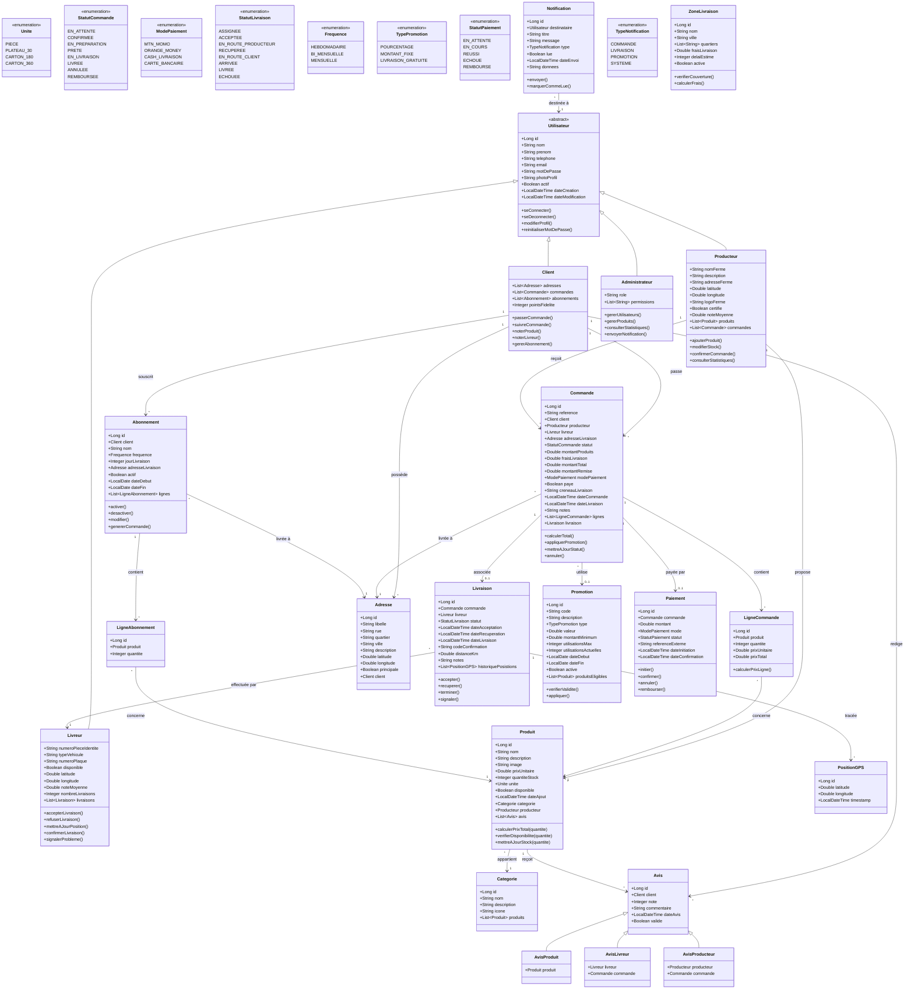

# Description Statique - Diagramme de Classes

## 1. Introduction

Ce document présente la modélisation statique du système EggGo à travers le diagramme de classes UML. Ce diagramme représente la structure des données et les relations entre les entités du système.

---

## 2. Diagramme de Classes Complet



---

## 3. Description des Classes Principales

### 3.1 Classe Utilisateur (Abstraite)

La classe `Utilisateur` est la classe mère de tous les types d'utilisateurs du système.

| Attribut | Type | Description |
|----------|------|-------------|
| id | Long | Identifiant unique |
| nom | String | Nom de famille |
| prenom | String | Prénom |
| telephone | String | Numéro de téléphone (unique) |
| email | String | Adresse email (optionnel) |
| motDePasse | String | Mot de passe hashé |
| photoProfil | String | URL de la photo |
| actif | Boolean | Compte actif ou désactivé |
| dateCreation | LocalDateTime | Date de création du compte |

### 3.2 Classe Client

Hérite de `Utilisateur`. Représente un client qui commande des œufs.

| Attribut spécifique | Type | Description |
|---------------------|------|-------------|
| adresses | List<Adresse> | Adresses de livraison |
| commandes | List<Commande> | Historique des commandes |
| abonnements | List<Abonnement> | Abonnements actifs |
| pointsFidelite | Integer | Points de fidélité cumulés |

### 3.3 Classe Livreur

Hérite de `Utilisateur`. Représente un livreur partenaire.

| Attribut spécifique | Type | Description |
|---------------------|------|-------------|
| numeroPieceIdentite | String | CNI ou passeport |
| typeVehicule | String | Moto, vélo, voiture |
| numeroPlaque | String | Immatriculation |
| disponible | Boolean | Disponibilité actuelle |
| latitude/longitude | Double | Position GPS actuelle |
| noteMoyenne | Double | Note moyenne reçue |
| nombreLivraisons | Integer | Total livraisons effectuées |

### 3.4 Classe Producteur

Hérite de `Utilisateur`. Représente une ferme avicole partenaire.

| Attribut spécifique | Type | Description |
|---------------------|------|-------------|
| nomFerme | String | Nom commercial de la ferme |
| description | String | Description de la ferme |
| adresseFerme | String | Adresse physique |
| latitude/longitude | Double | Coordonnées GPS |
| logoFerme | String | URL du logo |
| certifie | Boolean | Certification qualité |
| noteMoyenne | Double | Note moyenne reçue |

### 3.5 Classe Produit

Représente un produit (type d'œuf) disponible à la vente.

| Attribut | Type | Description |
|----------|------|-------------|
| id | Long | Identifiant unique |
| nom | String | Nom du produit |
| description | String | Description détaillée |
| image | String | URL de l'image |
| prixUnitaire | Double | Prix par unité |
| quantiteStock | Integer | Stock disponible |
| unite | Unite | Unité de vente (pièce, plateau, carton) |
| disponible | Boolean | Disponibilité |
| categorie | Categorie | Catégorie du produit |
| producteur | Producteur | Ferme productrice |

### 3.6 Classe Commande

Représente une commande passée par un client.

| Attribut | Type | Description |
|----------|------|-------------|
| id | Long | Identifiant unique |
| reference | String | Référence unique (ex: EGG-2026-001234) |
| client | Client | Client ayant passé la commande |
| producteur | Producteur | Ferme concernée |
| livreur | Livreur | Livreur assigné |
| adresseLivraison | Adresse | Adresse de livraison |
| statut | StatutCommande | État actuel |
| montantProduits | Double | Sous-total produits |
| fraisLivraison | Double | Frais de livraison |
| montantTotal | Double | Total à payer |
| modePaiement | ModePaiement | Mode de paiement choisi |
| paye | Boolean | Paiement effectué |
| creneauLivraison | String | Créneau demandé |
| lignes | List<LigneCommande> | Détail des produits |

### 3.7 Classe Livraison

Représente le processus de livraison d'une commande.

| Attribut | Type | Description |
|----------|------|-------------|
| id | Long | Identifiant unique |
| commande | Commande | Commande associée |
| livreur | Livreur | Livreur en charge |
| statut | StatutLivraison | État de la livraison |
| codeConfirmation | String | Code à 4 chiffres pour confirmation |
| distanceKm | Double | Distance calculée |
| historiquePositions | List<PositionGPS> | Suivi GPS |

### 3.8 Classe Abonnement

Représente un abonnement récurrent pour des livraisons automatiques.

| Attribut | Type | Description |
|----------|------|-------------|
| id | Long | Identifiant unique |
| client | Client | Client abonné |
| nom | String | Nom de l'abonnement |
| frequence | Frequence | Fréquence de livraison |
| jourLivraison | Integer | Jour préféré (1-7) |
| adresseLivraison | Adresse | Adresse de livraison |
| actif | Boolean | Abonnement actif |
| lignes | List<LigneAbonnement> | Produits de l'abonnement |

---

## 4. Relations entre Classes

### 4.1 Héritage

```
Utilisateur (abstraite)
    ├── Client
    ├── Livreur
    ├── Producteur
    └── Administrateur

Avis (abstraite)
    ├── AvisProduit
    ├── AvisLivreur
    └── AvisProducteur
```

### 4.2 Associations principales

| Classe source | Classe cible | Cardinalité | Description |
|---------------|--------------|-------------|-------------|
| Client | Adresse | 1..* | Un client a plusieurs adresses |
| Client | Commande | 0..* | Un client peut avoir plusieurs commandes |
| Producteur | Produit | 1..* | Un producteur propose plusieurs produits |
| Commande | LigneCommande | 1..* | Une commande contient plusieurs lignes |
| Commande | Livraison | 1..0..1 | Une commande a au plus une livraison |
| Livraison | PositionGPS | 1..* | Une livraison a plusieurs positions |

---

## 5. Dictionnaire de Données

### 5.1 Énumérations

#### StatutCommande
| Valeur | Description |
|--------|-------------|
| EN_ATTENTE | Commande créée, en attente de confirmation |
| CONFIRMEE | Confirmée par le producteur |
| EN_PREPARATION | En cours de préparation |
| PRETE | Prête pour récupération |
| EN_LIVRAISON | En cours de livraison |
| LIVREE | Livrée avec succès |
| ANNULEE | Annulée |
| REMBOURSEE | Remboursée |

#### ModePaiement
| Valeur | Description |
|--------|-------------|
| MTN_MOMO | MTN Mobile Money |
| ORANGE_MONEY | Orange Money |
| CASH_LIVRAISON | Espèces à la livraison |
| CARTE_BANCAIRE | Carte bancaire (Visa/Mastercard) |

#### Unite
| Valeur | Quantité | Description |
|--------|----------|-------------|
| PIECE | 1 | Œuf à l'unité |
| PLATEAU_30 | 30 | Plateau standard |
| CARTON_180 | 180 | Carton de 6 plateaux |
| CARTON_360 | 360 | Carton de 12 plateaux |

#### Frequence
| Valeur | Description |
|--------|-------------|
| HEBDOMADAIRE | Chaque semaine |
| BI_MENSUELLE | Deux fois par mois |
| MENSUELLE | Une fois par mois |

---

## 6. Contraintes d'Intégrité

### 6.1 Contraintes de clé

- `Utilisateur.telephone` : Unique
- `Utilisateur.email` : Unique (si renseigné)
- `Commande.reference` : Unique
- `Promotion.code` : Unique

### 6.2 Contraintes métier

1. Un `Client` doit avoir au moins une `Adresse` pour passer commande
2. Un `Livreur` ne peut avoir qu'une seule `Livraison` en cours (statut != LIVREE)
3. Une `Commande` ne peut être assignée à un `Livreur` que si `statut` = PRETE
4. Le `stock` d'un `Produit` ne peut pas être négatif
5. Une `Promotion` ne peut être utilisée que si `utilisationsActuelles` < `utilisationsMax`

### 6.3 Règles de gestion

| Règle | Description |
|-------|-------------|
| RG1 | Les frais de livraison sont calculés en fonction de la `ZoneLivraison` |
| RG2 | Une commande annulée après paiement génère un remboursement |
| RG3 | Un livreur avec une note < 3.0 est automatiquement désactivé |
| RG4 | Les abonnements génèrent des commandes automatiques |
| RG5 | Les points de fidélité = 1 point pour 1000 FCFA dépensés |

---

## 7. Conclusion

Ce diagramme de classes constitue le modèle de données central du système EggGo. Il servira de base pour :
- La création des entités JPA (Spring Boot)
- La conception de la base de données
- La création des modèles Dart (Flutter)
- L'implémentation des règles métier

---

*Document rédigé le 30 janvier 2026 - Projet EggGo*
