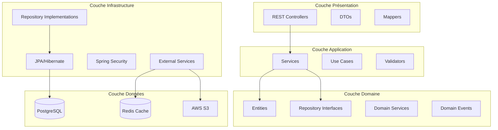

# Architecture Logique - API Spring Boot

## 1. Introduction

Ce document décrit l'architecture logique de l'API backend EggGo développée avec Spring Boot. L'architecture suit les principes de la Clean Architecture et du Domain-Driven Design (DDD).

---

## 2. Vue d'Ensemble de l'Architecture

### 2.1 Architecture en Couches



### 2.2 Principes Architecturaux

| Principe | Description |
|----------|-------------|
| **Separation of Concerns** | Chaque couche a une responsabilité unique |
| **Dependency Inversion** | Les couches supérieures ne dépendent pas des inférieures |
| **Single Responsibility** | Une classe = une responsabilité |
| **Open/Closed** | Ouvert à l'extension, fermé à la modification |
| **Interface Segregation** | Interfaces spécifiques plutôt que générales |

---

## 3. Structure du Projet

```
egggo/
├── src/
│   ├── main/
│   │   ├── java/
│   │   │   └── com/
│   │   │       └── egggo/
│   │   │           ├── EgggoApplication.java
│   │   │           │
│   │   │           ├── config/
│   │   │           │   ├── SecurityConfig.java
│   │   │           │   ├── SwaggerConfig.java
│   │   │           │   ├── CorsConfig.java
│   │   │           │   ├── CacheConfig.java
│   │   │           │   └── AsyncConfig.java
│   │   │           │
│   │   │           ├── domain/
│   │   │           │   ├── model/
│   │   │           │   │   ├── user/
│   │   │           │   │   │   ├── Utilisateur.java
│   │   │           │   │   │   ├── Client.java
│   │   │           │   │   │   ├── Livreur.java
│   │   │           │   │   │   ├── Producteur.java
│   │   │           │   │   │   └── Administrateur.java
│   │   │           │   │   ├── product/
│   │   │           │   │   │   ├── Produit.java
│   │   │           │   │   │   ├── Categorie.java
│   │   │           │   │   │   └── Unite.java
│   │   │           │   │   ├── order/
│   │   │           │   │   │   ├── Commande.java
│   │   │           │   │   │   ├── LigneCommande.java
│   │   │           │   │   │   ├── StatutCommande.java
│   │   │           │   │   │   └── ModePaiement.java
│   │   │           │   │   ├── delivery/
│   │   │           │   │   │   ├── Livraison.java
│   │   │           │   │   │   ├── StatutLivraison.java
│   │   │           │   │   │   └── PositionGPS.java
│   │   │           │   │   ├── subscription/
│   │   │           │   │   │   ├── Abonnement.java
│   │   │           │   │   │   ├── LigneAbonnement.java
│   │   │           │   │   │   └── Frequence.java
│   │   │           │   │   ├── review/
│   │   │           │   │   │   ├── Avis.java
│   │   │           │   │   │   ├── AvisProduit.java
│   │   │           │   │   │   └── AvisLivreur.java
│   │   │           │   │   ├── payment/
│   │   │           │   │   │   ├── Paiement.java
│   │   │           │   │   │   └── StatutPaiement.java
│   │   │           │   │   ├── promotion/
│   │   │           │   │   │   ├── Promotion.java
│   │   │           │   │   │   └── TypePromotion.java
│   │   │           │   │   └── common/
│   │   │           │   │       ├── Adresse.java
│   │   │           │   │       ├── Notification.java
│   │   │           │   │       └── ZoneLivraison.java
│   │   │           │   │
│   │   │           │   ├── repository/
│   │   │           │   │   ├── UtilisateurRepository.java
│   │   │           │   │   ├── ClientRepository.java
│   │   │           │   │   ├── LivreurRepository.java
│   │   │           │   │   ├── ProducteurRepository.java
│   │   │           │   │   ├── ProduitRepository.java
│   │   │           │   │   ├── CommandeRepository.java
│   │   │           │   │   ├── LivraisonRepository.java
│   │   │           │   │   ├── AbonnementRepository.java
│   │   │           │   │   └── PaiementRepository.java
│   │   │           │   │
│   │   │           │   ├── service/
│   │   │           │   │   └── DomainEventPublisher.java
│   │   │           │   │
│   │   │           │   └── event/
│   │   │           │       ├── CommandeCreatedEvent.java
│   │   │           │       ├── CommandeConfirmedEvent.java
│   │   │           │       ├── LivraisonStartedEvent.java
│   │   │           │       └── LivraisonCompletedEvent.java
│   │   │           │
│   │   │           ├── application/
│   │   │           │   ├── service/
│   │   │           │   │   ├── AuthService.java
│   │   │           │   │   ├── ClientService.java
│   │   │           │   │   ├── LivreurService.java
│   │   │           │   │   ├── ProducteurService.java
│   │   │           │   │   ├── ProduitService.java
│   │   │           │   │   ├── CommandeService.java
│   │   │           │   │   ├── LivraisonService.java
│   │   │           │   │   ├── AbonnementService.java
│   │   │           │   │   ├── PaiementService.java
│   │   │           │   │   ├── NotificationService.java
│   │   │           │   │   └── StatistiqueService.java
│   │   │           │   │
│   │   │           │   ├── dto/
│   │   │           │   │   ├── request/
│   │   │           │   │   │   ├── LoginRequest.java
│   │   │           │   │   │   ├── RegisterRequest.java
│   │   │           │   │   │   ├── CreateCommandeRequest.java
│   │   │           │   │   │   ├── UpdateCommandeRequest.java
│   │   │           │   │   │   └── ...
│   │   │           │   │   └── response/
│   │   │           │   │       ├── LoginResponse.java
│   │   │           │   │       ├── ClientResponse.java
│   │   │           │   │       ├── CommandeResponse.java
│   │   │           │   │       ├── ProduitResponse.java
│   │   │           │   │       └── ...
│   │   │           │   │
│   │   │           │   ├── mapper/
│   │   │           │   │   ├── ClientMapper.java
│   │   │           │   │   ├── ProduitMapper.java
│   │   │           │   │   ├── CommandeMapper.java
│   │   │           │   │   └── ...
│   │   │           │   │
│   │   │           │   └── exception/
│   │   │           │       ├── ResourceNotFoundException.java
│   │   │           │       ├── BusinessException.java
│   │   │           │       ├── UnauthorizedException.java
│   │   │           │       └── PaymentException.java
│   │   │           │
│   │   │           ├── infrastructure/
│   │   │           │   ├── persistence/
│   │   │           │   │   └── jpa/
│   │   │           │   │       ├── JpaClientRepository.java
│   │   │           │   │       ├── JpaProduitRepository.java
│   │   │           │   │       └── ...
│   │   │           │   │
│   │   │           │   ├── security/
│   │   │           │   │   ├── JwtTokenProvider.java
│   │   │           │   │   ├── JwtAuthenticationFilter.java
│   │   │           │   │   ├── UserDetailsServiceImpl.java
│   │   │           │   │   └── SecurityUtils.java
│   │   │           │   │
│   │   │           │   ├── external/
│   │   │           │   │   ├── payment/
│   │   │           │   │   │   ├── MomoPaymentService.java
│   │   │           │   │   │   ├── OrangeMoneyService.java
│   │   │           │   │   │   └── PaymentGateway.java
│   │   │           │   │   ├── notification/
│   │   │           │   │   │   ├── FirebaseNotificationService.java
│   │   │           │   │   │   ├── SmsService.java
│   │   │           │   │   │   └── EmailService.java
│   │   │           │   │   ├── storage/
│   │   │           │   │   │   └── S3StorageService.java
│   │   │           │   │   └── maps/
│   │   │           │   │       └── GoogleMapsService.java
│   │   │           │   │
│   │   │           │   └── scheduler/
│   │   │           │       ├── AbonnementScheduler.java
│   │   │           │       └── NotificationScheduler.java
│   │   │           │
│   │   │           └── api/
│   │   │               ├── controller/
│   │   │               │   ├── AuthController.java
│   │   │               │   ├── ClientController.java
│   │   │               │   ├── LivreurController.java
│   │   │               │   ├── ProducteurController.java
│   │   │               │   ├── ProduitController.java
│   │   │               │   ├── CommandeController.java
│   │   │               │   ├── LivraisonController.java
│   │   │               │   ├── AbonnementController.java
│   │   │               │   ├── PaiementController.java
│   │   │               │   ├── NotificationController.java
│   │   │               │   └── AdminController.java
│   │   │               │
│   │   │               ├── advice/
│   │   │               │   └── GlobalExceptionHandler.java
│   │   │               │
│   │   │               └── filter/
│   │   │                   └── RequestLoggingFilter.java
│   │   │
│   │   └── resources/
│   │       ├── application.yml
│   │       ├── application-dev.yml
│   │       ├── application-prod.yml
│   │       └── db/
│   │           └── migration/
│   │               ├── V1__init_schema.sql
│   │               ├── V2__add_indexes.sql
│   │               └── V3__seed_data.sql
│   │
│   └── test/
│       └── java/
│           └── com/
│               └── egggo/
│                   ├── unit/
│                   ├── integration/
│                   └── e2e/
│
├── pom.xml
├── Dockerfile
├── docker-compose.yml
└── README.md
```

---

## 4. Description des Couches

### 4.1 Couche API (Présentation)

Cette couche gère les requêtes HTTP et les réponses.

#### Controllers

```java
@RestController
@RequestMapping("/api/v1/commandes")
@RequiredArgsConstructor
public class CommandeController {
    
    private final CommandeService commandeService;
    
    @PostMapping
    @ResponseStatus(HttpStatus.CREATED)
    public CommandeResponse creerCommande(
            @Valid @RequestBody CreateCommandeRequest request,
            @AuthenticationPrincipal UserDetails user) {
        return commandeService.creerCommande(request, user.getUsername());
    }
    
    @GetMapping("/{id}")
    public CommandeResponse getCommande(@PathVariable Long id) {
        return commandeService.getCommande(id);
    }
    
    @GetMapping
    public Page<CommandeResponse> getCommandes(
            @RequestParam(defaultValue = "0") int page,
            @RequestParam(defaultValue = "10") int size) {
        return commandeService.getCommandes(PageRequest.of(page, size));
    }
    
    @PutMapping("/{id}/statut")
    public CommandeResponse updateStatut(
            @PathVariable Long id,
            @RequestBody UpdateStatutRequest request) {
        return commandeService.updateStatut(id, request);
    }
}
```

#### DTOs

```java
// Request DTO
@Data
@Builder
public class CreateCommandeRequest {
    @NotNull
    private Long adresseId;
    
    @NotEmpty
    private List<LigneCommandeRequest> lignes;
    
    @NotNull
    private ModePaiement modePaiement;
    
    private String creneauLivraison;
    private String codePromo;
    private String notes;
}

// Response DTO
@Data
@Builder
public class CommandeResponse {
    private Long id;
    private String reference;
    private ClientResponse client;
    private ProducteurResponse producteur;
    private List<LigneCommandeResponse> lignes;
    private AdresseResponse adresseLivraison;
    private StatutCommande statut;
    private Double montantTotal;
    private ModePaiement modePaiement;
    private LocalDateTime dateCommande;
}
```

### 4.2 Couche Application (Services)

Cette couche contient la logique métier.

```java
@Service
@RequiredArgsConstructor
@Transactional
public class CommandeService {
    
    private final CommandeRepository commandeRepository;
    private final ClientRepository clientRepository;
    private final ProduitRepository produitRepository;
    private final PaiementService paiementService;
    private final NotificationService notificationService;
    private final CommandeMapper commandeMapper;
    
    public CommandeResponse creerCommande(CreateCommandeRequest request, String telephone) {
        // 1. Récupérer le client
        Client client = clientRepository.findByTelephone(telephone)
                .orElseThrow(() -> new ResourceNotFoundException("Client non trouvé"));
        
        // 2. Valider les produits et le stock
        List<LigneCommande> lignes = validateAndCreateLignes(request.getLignes());
        
        // 3. Créer la commande
        Commande commande = Commande.builder()
                .reference(generateReference())
                .client(client)
                .lignes(lignes)
                .statut(StatutCommande.EN_ATTENTE)
                .modePaiement(request.getModePaiement())
                .build();
        
        // 4. Calculer les montants
        commande.calculerTotal();
        
        // 5. Appliquer la promotion si présente
        if (request.getCodePromo() != null) {
            applyPromotion(commande, request.getCodePromo());
        }
        
        // 6. Sauvegarder
        commande = commandeRepository.save(commande);
        
        // 7. Initier le paiement si nécessaire
        if (request.getModePaiement() != ModePaiement.CASH_LIVRAISON) {
            paiementService.initierPaiement(commande);
        }
        
        // 8. Notifier le producteur
        notificationService.notifierNouvelleCommande(commande);
        
        return commandeMapper.toResponse(commande);
    }
}
```

### 4.3 Couche Domaine (Entités)

Cette couche contient les entités métier.

```java
@Entity
@Table(name = "commandes")
@Data
@Builder
@NoArgsConstructor
@AllArgsConstructor
public class Commande {
    
    @Id
    @GeneratedValue(strategy = GenerationType.IDENTITY)
    private Long id;
    
    @Column(unique = true, nullable = false)
    private String reference;
    
    @ManyToOne(fetch = FetchType.LAZY)
    @JoinColumn(name = "client_id", nullable = false)
    private Client client;
    
    @ManyToOne(fetch = FetchType.LAZY)
    @JoinColumn(name = "producteur_id")
    private Producteur producteur;
    
    @ManyToOne(fetch = FetchType.LAZY)
    @JoinColumn(name = "livreur_id")
    private Livreur livreur;
    
    @OneToMany(mappedBy = "commande", cascade = CascadeType.ALL)
    private List<LigneCommande> lignes;
    
    @ManyToOne(fetch = FetchType.LAZY)
    @JoinColumn(name = "adresse_id")
    private Adresse adresseLivraison;
    
    @Enumerated(EnumType.STRING)
    private StatutCommande statut;
    
    @Enumerated(EnumType.STRING)
    private ModePaiement modePaiement;
    
    private Double montantProduits;
    private Double fraisLivraison;
    private Double montantRemise;
    private Double montantTotal;
    private Boolean paye;
    
    private LocalDateTime dateCommande;
    private LocalDateTime dateLivraison;
    
    @PrePersist
    public void prePersist() {
        dateCommande = LocalDateTime.now();
        paye = false;
    }
    
    public void calculerTotal() {
        this.montantProduits = lignes.stream()
                .mapToDouble(LigneCommande::getPrixTotal)
                .sum();
        this.montantTotal = montantProduits + fraisLivraison - (montantRemise != null ? montantRemise : 0);
    }
}
```

### 4.4 Couche Infrastructure

#### Sécurité (JWT)

```java
@Component
@RequiredArgsConstructor
public class JwtTokenProvider {
    
    @Value("${jwt.secret}")
    private String jwtSecret;
    
    @Value("${jwt.expiration}")
    private long jwtExpiration;
    
    public String generateToken(UserDetails userDetails) {
        Map<String, Object> claims = new HashMap<>();
        claims.put("roles", userDetails.getAuthorities());
        
        return Jwts.builder()
                .setClaims(claims)
                .setSubject(userDetails.getUsername())
                .setIssuedAt(new Date())
                .setExpiration(new Date(System.currentTimeMillis() + jwtExpiration))
                .signWith(SignatureAlgorithm.HS512, jwtSecret)
                .compact();
    }
    
    public String getUsernameFromToken(String token) {
        return Jwts.parser()
                .setSigningKey(jwtSecret)
                .parseClaimsJws(token)
                .getBody()
                .getSubject();
    }
    
    public boolean validateToken(String token) {
        try {
            Jwts.parser().setSigningKey(jwtSecret).parseClaimsJws(token);
            return true;
        } catch (JwtException | IllegalArgumentException e) {
            return false;
        }
    }
}
```

#### Intégration Mobile Money

```java
@Service
@RequiredArgsConstructor
@Slf4j
public class MomoPaymentService implements PaymentGateway {
    
    @Value("${momo.api.url}")
    private String apiUrl;
    
    @Value("${momo.api.key}")
    private String apiKey;
    
    private final RestTemplate restTemplate;
    
    @Override
    public PaymentResponse initierPaiement(Paiement paiement) {
        MomoRequest request = MomoRequest.builder()
                .amount(paiement.getMontant())
                .currency("XAF")
                .externalId(paiement.getCommande().getReference())
                .payer(MomoPayer.builder()
                        .partyIdType("MSISDN")
                        .partyId(paiement.getCommande().getClient().getTelephone())
                        .build())
                .payerMessage("Paiement EggGo - " + paiement.getCommande().getReference())
                .build();
        
        HttpHeaders headers = new HttpHeaders();
        headers.set("Authorization", "Bearer " + apiKey);
        headers.setContentType(MediaType.APPLICATION_JSON);
        
        ResponseEntity<MomoResponse> response = restTemplate.exchange(
                apiUrl + "/requesttopay",
                HttpMethod.POST,
                new HttpEntity<>(request, headers),
                MomoResponse.class
        );
        
        return PaymentResponse.builder()
                .success(response.getStatusCode().is2xxSuccessful())
                .referenceExterne(response.getBody().getReferenceId())
                .build();
    }
}
```

---

## 5. Endpoints API REST

### 5.1 Authentification

| Méthode | Endpoint | Description |
|---------|----------|-------------|
| POST | `/api/v1/auth/register` | Inscription |
| POST | `/api/v1/auth/login` | Connexion |
| POST | `/api/v1/auth/refresh` | Rafraîchir le token |
| POST | `/api/v1/auth/logout` | Déconnexion |
| POST | `/api/v1/auth/forgot-password` | Mot de passe oublié |
| POST | `/api/v1/auth/reset-password` | Réinitialiser mot de passe |

### 5.2 Clients

| Méthode | Endpoint | Description |
|---------|----------|-------------|
| GET | `/api/v1/clients/me` | Profil client connecté |
| PUT | `/api/v1/clients/me` | Modifier profil |
| GET | `/api/v1/clients/me/adresses` | Lister adresses |
| POST | `/api/v1/clients/me/adresses` | Ajouter adresse |
| PUT | `/api/v1/clients/me/adresses/{id}` | Modifier adresse |
| DELETE | `/api/v1/clients/me/adresses/{id}` | Supprimer adresse |

### 5.3 Produits

| Méthode | Endpoint | Description |
|---------|----------|-------------|
| GET | `/api/v1/produits` | Lister produits |
| GET | `/api/v1/produits/{id}` | Détail produit |
| GET | `/api/v1/produits/categories` | Lister catégories |
| GET | `/api/v1/produits/recherche` | Rechercher produits |

### 5.4 Commandes

| Méthode | Endpoint | Description |
|---------|----------|-------------|
| POST | `/api/v1/commandes` | Créer commande |
| GET | `/api/v1/commandes` | Lister mes commandes |
| GET | `/api/v1/commandes/{id}` | Détail commande |
| PUT | `/api/v1/commandes/{id}/annuler` | Annuler commande |
| GET | `/api/v1/commandes/{id}/suivi` | Suivi temps réel |

### 5.5 Livraisons (Livreur)

| Méthode | Endpoint | Description |
|---------|----------|-------------|
| GET | `/api/v1/livraisons/disponibles` | Livraisons disponibles |
| POST | `/api/v1/livraisons/{id}/accepter` | Accepter livraison |
| POST | `/api/v1/livraisons/{id}/refuser` | Refuser livraison |
| PUT | `/api/v1/livraisons/{id}/position` | Mettre à jour position |
| POST | `/api/v1/livraisons/{id}/recuperer` | Confirmer récupération |
| POST | `/api/v1/livraisons/{id}/terminer` | Confirmer livraison |

### 5.6 Producteurs

| Méthode | Endpoint | Description |
|---------|----------|-------------|
| GET | `/api/v1/producteurs/me/produits` | Mes produits |
| POST | `/api/v1/producteurs/me/produits` | Ajouter produit |
| PUT | `/api/v1/producteurs/me/produits/{id}` | Modifier produit |
| PUT | `/api/v1/producteurs/me/produits/{id}/stock` | Modifier stock |
| GET | `/api/v1/producteurs/me/commandes` | Mes commandes |
| PUT | `/api/v1/producteurs/me/commandes/{id}/confirmer` | Confirmer commande |

### 5.7 Abonnements

| Méthode | Endpoint | Description |
|---------|----------|-------------|
| GET | `/api/v1/abonnements` | Mes abonnements |
| POST | `/api/v1/abonnements` | Créer abonnement |
| PUT | `/api/v1/abonnements/{id}` | Modifier abonnement |
| PUT | `/api/v1/abonnements/{id}/activer` | Activer abonnement |
| PUT | `/api/v1/abonnements/{id}/desactiver` | Désactiver abonnement |
| DELETE | `/api/v1/abonnements/{id}` | Supprimer abonnement |

---

## 6. Technologies et Dépendances

### 6.1 Stack Technique

| Catégorie | Technologie | Version |
|-----------|-------------|---------|
| **Framework** | Spring Boot | 3.2.x |
| **Langage** | Java | 17+ |
| **Base de données** | PostgreSQL | 15.x |
| **Cache** | Redis | 7.x |
| **ORM** | Hibernate/JPA | 6.x |
| **Sécurité** | Spring Security + JWT | 6.x |
| **Documentation** | SpringDoc OpenAPI | 2.x |
| **Migration DB** | Flyway | 9.x |
| **Tests** | JUnit 5 + Mockito | 5.x |

### 6.2 Dépendances Maven

```xml
<dependencies>
    <!-- Spring Boot Starters -->
    <dependency>
        <groupId>org.springframework.boot</groupId>
        <artifactId>spring-boot-starter-web</artifactId>
    </dependency>
    <dependency>
        <groupId>org.springframework.boot</groupId>
        <artifactId>spring-boot-starter-data-jpa</artifactId>
    </dependency>
    <dependency>
        <groupId>org.springframework.boot</groupId>
        <artifactId>spring-boot-starter-security</artifactId>
    </dependency>
    <dependency>
        <groupId>org.springframework.boot</groupId>
        <artifactId>spring-boot-starter-validation</artifactId>
    </dependency>
    <dependency>
        <groupId>org.springframework.boot</groupId>
        <artifactId>spring-boot-starter-data-redis</artifactId>
    </dependency>
    
    <!-- JWT -->
    <dependency>
        <groupId>io.jsonwebtoken</groupId>
        <artifactId>jjwt</artifactId>
        <version>0.9.1</version>
    </dependency>
    
    <!-- Database -->
    <dependency>
        <groupId>org.postgresql</groupId>
        <artifactId>postgresql</artifactId>
        <scope>runtime</scope>
    </dependency>
    <dependency>
        <groupId>org.flywaydb</groupId>
        <artifactId>flyway-core</artifactId>
    </dependency>
    
    <!-- Documentation -->
    <dependency>
        <groupId>org.springdoc</groupId>
        <artifactId>springdoc-openapi-starter-webmvc-ui</artifactId>
        <version>2.3.0</version>
    </dependency>
    
    <!-- Utilities -->
    <dependency>
        <groupId>org.projectlombok</groupId>
        <artifactId>lombok</artifactId>
        <optional>true</optional>
    </dependency>
    <dependency>
        <groupId>org.mapstruct</groupId>
        <artifactId>mapstruct</artifactId>
        <version>1.5.5.Final</version>
    </dependency>
</dependencies>
```

---

## 7. Configuration

### 7.1 application.yml

```yaml
spring:
  application:
    name: egggo-api
  
  datasource:
    url: jdbc:postgresql://${DB_HOST:localhost}:5432/${DB_NAME:egggo}
    username: ${DB_USER:postgres}
    password: ${DB_PASSWORD:postgres}
    driver-class-name: org.postgresql.Driver
  
  jpa:
    hibernate:
      ddl-auto: validate
    show-sql: false
    properties:
      hibernate:
        dialect: org.hibernate.dialect.PostgreSQLDialect
        format_sql: true
  
  flyway:
    enabled: true
    locations: classpath:db/migration
  
  data:
    redis:
      host: ${REDIS_HOST:localhost}
      port: ${REDIS_PORT:6379}

jwt:
  secret: ${JWT_SECRET:mySecretKey}
  expiration: 86400000  # 24 heures

server:
  port: 8080

# Services externes
momo:
  api:
    url: https://sandbox.momodeveloper.mtn.com
    key: ${MOMO_API_KEY}

orange:
  api:
    url: https://api.orange.com/orange-money-webpay
    key: ${ORANGE_API_KEY}

firebase:
  credentials: ${FIREBASE_CREDENTIALS_PATH}

aws:
  s3:
    bucket: ${AWS_S3_BUCKET:egggo-images}
    region: ${AWS_REGION:eu-west-1}
```

---

## 8. Sécurité

### 8.1 Configuration Spring Security

```java
@Configuration
@EnableWebSecurity
@RequiredArgsConstructor
public class SecurityConfig {
    
    private final JwtAuthenticationFilter jwtAuthFilter;
    private final UserDetailsServiceImpl userDetailsService;
    
    @Bean
    public SecurityFilterChain securityFilterChain(HttpSecurity http) throws Exception {
        http
            .csrf(csrf -> csrf.disable())
            .cors(cors -> cors.configurationSource(corsConfigurationSource()))
            .sessionManagement(session -> 
                session.sessionCreationPolicy(SessionCreationPolicy.STATELESS))
            .authorizeHttpRequests(auth -> auth
                .requestMatchers("/api/v1/auth/**").permitAll()
                .requestMatchers("/api/v1/produits/**").permitAll()
                .requestMatchers("/swagger-ui/**", "/v3/api-docs/**").permitAll()
                .requestMatchers("/api/v1/admin/**").hasRole("ADMIN")
                .requestMatchers("/api/v1/producteurs/**").hasRole("PRODUCTEUR")
                .requestMatchers("/api/v1/livreurs/**").hasRole("LIVREUR")
                .anyRequest().authenticated()
            )
            .authenticationProvider(authenticationProvider())
            .addFilterBefore(jwtAuthFilter, UsernamePasswordAuthenticationFilter.class);
        
        return http.build();
    }
}
```

### 8.2 Rôles et Permissions

| Rôle | Permissions |
|------|-------------|
| CLIENT | Passer commandes, voir produits, gérer profil |
| LIVREUR | Gérer livraisons, mettre à jour position |
| PRODUCTEUR | Gérer produits, gérer stock, confirmer commandes |
| ADMIN | Toutes les permissions |

---

## 9. Conclusion

Cette architecture Spring Boot offre :
- Une séparation claire des responsabilités
- Une scalabilité horizontale
- Une sécurité robuste avec JWT
- Une intégration facile des services externes (paiement, notifications)
- Une documentation automatique via OpenAPI

---

*Document rédigé le 30 janvier 2026 - Projet EggGo*
