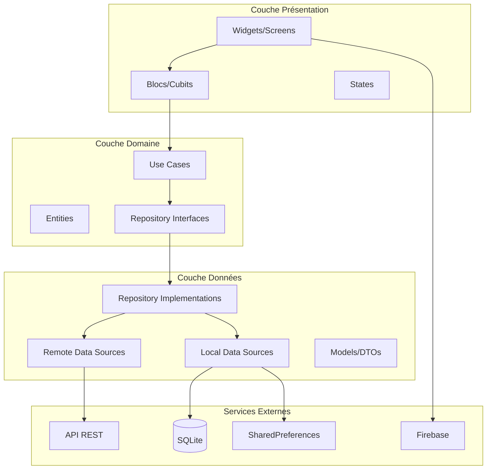

# Architecture Logique - Application Mobile Flutter

## 1. Introduction

Ce document décrit l'architecture logique de l'application mobile EggGo développée avec Flutter. L'architecture suit le pattern Clean Architecture combiné avec le state management Bloc/Cubit.

---

## 2. Vue d'Ensemble de l'Architecture

### 2.1 Architecture en Couches



### 2.2 Principes Architecturaux

| Principe | Description |
|----------|-------------|
| **Clean Architecture** | Séparation en couches indépendantes |
| **SOLID** | Principes de conception orientée objet |
| **DRY** | Don't Repeat Yourself |
| **Dependency Injection** | Injection de dépendances via GetIt |
| **Reactive Programming** | Flux de données réactif avec Bloc |

---

## 3. Structure du Projet

```
egggo_mobile/
├── lib/
│   ├── main.dart
│   ├── app.dart
│   │
│   ├── core/
│   │   ├── constants/
│   │   │   ├── app_colors.dart
│   │   │   ├── app_strings.dart
│   │   │   ├── app_sizes.dart
│   │   │   ├── api_endpoints.dart
│   │   │   └── asset_paths.dart
│   │   │
│   │   ├── theme/
│   │   │   ├── app_theme.dart
│   │   │   ├── text_styles.dart
│   │   │   └── button_styles.dart
│   │   │
│   │   ├── utils/
│   │   │   ├── validators.dart
│   │   │   ├── formatters.dart
│   │   │   ├── helpers.dart
│   │   │   └── extensions.dart
│   │   │
│   │   ├── errors/
│   │   │   ├── exceptions.dart
│   │   │   └── failures.dart
│   │   │
│   │   ├── network/
│   │   │   ├── api_client.dart
│   │   │   ├── api_interceptor.dart
│   │   │   ├── network_info.dart
│   │   │   └── api_response.dart
│   │   │
│   │   └── di/
│   │       └── injection_container.dart
│   │
│   ├── config/
│   │   ├── routes/
│   │   │   ├── app_router.dart
│   │   │   └── route_names.dart
│   │   │
│   │   └── environment/
│   │       ├── env_config.dart
│   │       └── flavor_config.dart
│   │
│   ├── features/
│   │   │
│   │   ├── auth/
│   │   │   ├── data/
│   │   │   │   ├── datasources/
│   │   │   │   │   ├── auth_remote_datasource.dart
│   │   │   │   │   └── auth_local_datasource.dart
│   │   │   │   ├── models/
│   │   │   │   │   ├── user_model.dart
│   │   │   │   │   ├── login_request.dart
│   │   │   │   │   └── login_response.dart
│   │   │   │   └── repositories/
│   │   │   │       └── auth_repository_impl.dart
│   │   │   │
│   │   │   ├── domain/
│   │   │   │   ├── entities/
│   │   │   │   │   └── user.dart
│   │   │   │   ├── repositories/
│   │   │   │   │   └── auth_repository.dart
│   │   │   │   └── usecases/
│   │   │   │       ├── login_usecase.dart
│   │   │   │       ├── register_usecase.dart
│   │   │   │       ├── logout_usecase.dart
│   │   │   │       └── get_current_user_usecase.dart
│   │   │   │
│   │   │   └── presentation/
│   │   │       ├── bloc/
│   │   │       │   ├── auth_bloc.dart
│   │   │       │   ├── auth_event.dart
│   │   │       │   └── auth_state.dart
│   │   │       ├── pages/
│   │   │       │   ├── login_page.dart
│   │   │       │   ├── register_page.dart
│   │   │       │   ├── forgot_password_page.dart
│   │   │       │   └── otp_verification_page.dart
│   │   │       └── widgets/
│   │   │           ├── phone_input_field.dart
│   │   │           └── social_login_buttons.dart
│   │   │
│   │   ├── home/
│   │   │   ├── data/
│   │   │   ├── domain/
│   │   │   └── presentation/
│   │   │       ├── bloc/
│   │   │       ├── pages/
│   │   │       │   └── home_page.dart
│   │   │       └── widgets/
│   │   │           ├── category_list.dart
│   │   │           ├── product_grid.dart
│   │   │           ├── promo_banner.dart
│   │   │           └── search_bar.dart
│   │   │
│   │   ├── products/
│   │   │   ├── data/
│   │   │   │   ├── datasources/
│   │   │   │   │   ├── product_remote_datasource.dart
│   │   │   │   │   └── product_local_datasource.dart
│   │   │   │   ├── models/
│   │   │   │   │   ├── product_model.dart
│   │   │   │   │   └── category_model.dart
│   │   │   │   └── repositories/
│   │   │   │       └── product_repository_impl.dart
│   │   │   │
│   │   │   ├── domain/
│   │   │   │   ├── entities/
│   │   │   │   │   ├── product.dart
│   │   │   │   │   └── category.dart
│   │   │   │   ├── repositories/
│   │   │   │   │   └── product_repository.dart
│   │   │   │   └── usecases/
│   │   │   │       ├── get_products_usecase.dart
│   │   │   │       ├── get_product_detail_usecase.dart
│   │   │   │       ├── search_products_usecase.dart
│   │   │   │       └── get_categories_usecase.dart
│   │   │   │
│   │   │   └── presentation/
│   │   │       ├── bloc/
│   │   │       │   ├── product_bloc.dart
│   │   │       │   ├── product_event.dart
│   │   │       │   └── product_state.dart
│   │   │       ├── pages/
│   │   │       │   ├── products_page.dart
│   │   │       │   └── product_detail_page.dart
│   │   │       └── widgets/
│   │   │           ├── product_card.dart
│   │   │           ├── quantity_selector.dart
│   │   │           └── producer_info.dart
│   │   │
│   │   ├── cart/
│   │   │   ├── data/
│   │   │   │   ├── datasources/
│   │   │   │   │   └── cart_local_datasource.dart
│   │   │   │   ├── models/
│   │   │   │   │   └── cart_item_model.dart
│   │   │   │   └── repositories/
│   │   │   │       └── cart_repository_impl.dart
│   │   │   │
│   │   │   ├── domain/
│   │   │   │   ├── entities/
│   │   │   │   │   └── cart_item.dart
│   │   │   │   ├── repositories/
│   │   │   │   │   └── cart_repository.dart
│   │   │   │   └── usecases/
│   │   │   │       ├── add_to_cart_usecase.dart
│   │   │   │       ├── remove_from_cart_usecase.dart
│   │   │   │       ├── update_quantity_usecase.dart
│   │   │   │       └── clear_cart_usecase.dart
│   │   │   │
│   │   │   └── presentation/
│   │   │       ├── bloc/
│   │   │       │   └── cart_cubit.dart
│   │   │       ├── pages/
│   │   │       │   └── cart_page.dart
│   │   │       └── widgets/
│   │   │           ├── cart_item_tile.dart
│   │   │           └── cart_summary.dart
│   │   │
│   │   ├── orders/
│   │   │   ├── data/
│   │   │   │   ├── datasources/
│   │   │   │   │   ├── order_remote_datasource.dart
│   │   │   │   │   └── order_local_datasource.dart
│   │   │   │   ├── models/
│   │   │   │   │   ├── order_model.dart
│   │   │   │   │   └── order_line_model.dart
│   │   │   │   └── repositories/
│   │   │   │       └── order_repository_impl.dart
│   │   │   │
│   │   │   ├── domain/
│   │   │   │   ├── entities/
│   │   │   │   │   ├── order.dart
│   │   │   │   │   └── order_status.dart
│   │   │   │   ├── repositories/
│   │   │   │   │   └── order_repository.dart
│   │   │   │   └── usecases/
│   │   │   │       ├── create_order_usecase.dart
│   │   │   │       ├── get_orders_usecase.dart
│   │   │   │       ├── get_order_detail_usecase.dart
│   │   │   │       ├── cancel_order_usecase.dart
│   │   │   │       └── track_order_usecase.dart
│   │   │   │
│   │   │   └── presentation/
│   │   │       ├── bloc/
│   │   │       │   ├── order_bloc.dart
│   │   │       │   └── order_tracking_cubit.dart
│   │   │       ├── pages/
│   │   │       │   ├── checkout_page.dart
│   │   │       │   ├── order_confirmation_page.dart
│   │   │       │   ├── orders_history_page.dart
│   │   │       │   ├── order_detail_page.dart
│   │   │       │   └── order_tracking_page.dart
│   │   │       └── widgets/
│   │   │           ├── address_selector.dart
│   │   │           ├── payment_method_selector.dart
│   │   │           ├── time_slot_selector.dart
│   │   │           ├── order_status_timeline.dart
│   │   │           └── delivery_map.dart
│   │   │
│   │   ├── addresses/
│   │   │   ├── data/
│   │   │   ├── domain/
│   │   │   └── presentation/
│   │   │       ├── bloc/
│   │   │       ├── pages/
│   │   │       │   ├── addresses_page.dart
│   │   │       │   └── add_address_page.dart
│   │   │       └── widgets/
│   │   │           ├── address_card.dart
│   │   │           └── map_picker.dart
│   │   │
│   │   ├── subscriptions/
│   │   │   ├── data/
│   │   │   ├── domain/
│   │   │   └── presentation/
│   │   │       ├── bloc/
│   │   │       ├── pages/
│   │   │       │   ├── subscriptions_page.dart
│   │   │       │   └── create_subscription_page.dart
│   │   │       └── widgets/
│   │   │           ├── subscription_card.dart
│   │   │           └── frequency_selector.dart
│   │   │
│   │   ├── profile/
│   │   │   ├── data/
│   │   │   ├── domain/
│   │   │   └── presentation/
│   │   │       ├── bloc/
│   │   │       ├── pages/
│   │   │       │   ├── profile_page.dart
│   │   │       │   ├── edit_profile_page.dart
│   │   │       │   └── settings_page.dart
│   │   │       └── widgets/
│   │   │
│   │   ├── notifications/
│   │   │   ├── data/
│   │   │   ├── domain/
│   │   │   └── presentation/
│   │   │       ├── bloc/
│   │   │       ├── pages/
│   │   │       │   └── notifications_page.dart
│   │   │       └── widgets/
│   │   │           └── notification_tile.dart
│   │   │
│   │   └── delivery/  # Pour l'app livreur
│   │       ├── data/
│   │       ├── domain/
│   │       └── presentation/
│   │
│   └── shared/
│       ├── widgets/
│       │   ├── app_button.dart
│       │   ├── app_text_field.dart
│       │   ├── app_loading.dart
│       │   ├── app_error.dart
│       │   ├── app_empty_state.dart
│       │   ├── app_bottom_sheet.dart
│       │   ├── app_dialog.dart
│       │   ├── rating_stars.dart
│       │   └── cached_network_image.dart
│       │
│       └── services/
│           ├── notification_service.dart
│           ├── location_service.dart
│           ├── storage_service.dart
│           └── analytics_service.dart
│
├── assets/
│   ├── images/
│   │   ├── logo.png
│   │   ├── logo_white.png
│   │   ├── onboarding/
│   │   └── placeholders/
│   │
│   ├── icons/
│   │   ├── egg.svg
│   │   ├── tray.svg
│   │   └── delivery.svg
│   │
│   ├── fonts/
│   │   ├── Poppins-Regular.ttf
│   │   ├── Poppins-Medium.ttf
│   │   ├── Poppins-SemiBold.ttf
│   │   └── Poppins-Bold.ttf
│   │
│   └── lottie/
│       ├── loading.json
│       ├── success.json
│       └── empty_cart.json
│
├── test/
│   ├── unit/
│   ├── widget/
│   └── integration/
│
├── pubspec.yaml
├── analysis_options.yaml
└── README.md
```

---

## 4. Description des Couches

### 4.1 Couche Présentation

#### Widgets/Screens

```dart
// lib/features/products/presentation/pages/product_detail_page.dart

class ProductDetailPage extends StatelessWidget {
  final String productId;
  
  const ProductDetailPage({
    super.key,
    required this.productId,
  });

  @override
  Widget build(BuildContext context) {
    return BlocProvider(
      create: (context) => sl<ProductBloc>()
        ..add(LoadProductDetail(productId)),
      child: Scaffold(
        appBar: AppBar(
          title: const Text('Détail produit'),
          actions: [
            IconButton(
              icon: const Icon(Icons.share),
              onPressed: () => _shareProduct(context),
            ),
          ],
        ),
        body: BlocBuilder<ProductBloc, ProductState>(
          builder: (context, state) {
            if (state is ProductLoading) {
              return const AppLoading();
            }
            if (state is ProductError) {
              return AppError(message: state.message);
            }
            if (state is ProductDetailLoaded) {
              return _buildContent(context, state.product);
            }
            return const SizedBox.shrink();
          },
        ),
        bottomNavigationBar: _buildAddToCartButton(context),
      ),
    );
  }
  
  Widget _buildContent(BuildContext context, Product product) {
    return SingleChildScrollView(
      child: Column(
        crossAxisAlignment: CrossAxisAlignment.start,
        children: [
          CachedNetworkImage(
            imageUrl: product.image,
            height: 250,
            width: double.infinity,
            fit: BoxFit.cover,
          ),
          Padding(
            padding: const EdgeInsets.all(16),
            child: Column(
              crossAxisAlignment: CrossAxisAlignment.start,
              children: [
                Text(
                  product.name,
                  style: Theme.of(context).textTheme.headlineSmall,
                ),
                const SizedBox(height: 8),
                Text(
                  '${product.price.formatCurrency()} / ${product.unit.label}',
                  style: Theme.of(context).textTheme.titleLarge?.copyWith(
                    color: AppColors.primary,
                    fontWeight: FontWeight.bold,
                  ),
                ),
                const SizedBox(height: 16),
                ProducerInfo(producer: product.producer),
                const SizedBox(height: 16),
                Text(product.description),
                const SizedBox(height: 16),
                QuantitySelector(
                  initialValue: 1,
                  onChanged: (value) => context.read<CartCubit>()
                    .updateTempQuantity(value),
                ),
              ],
            ),
          ),
        ],
      ),
    );
  }
}
```

#### Bloc Pattern

```dart
// lib/features/orders/presentation/bloc/order_bloc.dart

class OrderBloc extends Bloc<OrderEvent, OrderState> {
  final CreateOrderUseCase createOrderUseCase;
  final GetOrdersUseCase getOrdersUseCase;
  final GetOrderDetailUseCase getOrderDetailUseCase;
  final CancelOrderUseCase cancelOrderUseCase;

  OrderBloc({
    required this.createOrderUseCase,
    required this.getOrdersUseCase,
    required this.getOrderDetailUseCase,
    required this.cancelOrderUseCase,
  }) : super(OrderInitial()) {
    on<CreateOrder>(_onCreateOrder);
    on<LoadOrders>(_onLoadOrders);
    on<LoadOrderDetail>(_onLoadOrderDetail);
    on<CancelOrder>(_onCancelOrder);
  }

  Future<void> _onCreateOrder(
    CreateOrder event,
    Emitter<OrderState> emit,
  ) async {
    emit(OrderCreating());
    
    final result = await createOrderUseCase(
      CreateOrderParams(
        addressId: event.addressId,
        items: event.items,
        paymentMethod: event.paymentMethod,
        timeSlot: event.timeSlot,
        promoCode: event.promoCode,
      ),
    );
    
    result.fold(
      (failure) => emit(OrderError(failure.message)),
      (order) => emit(OrderCreated(order)),
    );
  }

  Future<void> _onLoadOrders(
    LoadOrders event,
    Emitter<OrderState> emit,
  ) async {
    emit(OrdersLoading());
    
    final result = await getOrdersUseCase(NoParams());
    
    result.fold(
      (failure) => emit(OrderError(failure.message)),
      (orders) => emit(OrdersLoaded(orders)),
    );
  }
}
```

```dart
// lib/features/orders/presentation/bloc/order_event.dart

abstract class OrderEvent extends Equatable {
  const OrderEvent();
}

class CreateOrder extends OrderEvent {
  final int addressId;
  final List<CartItem> items;
  final PaymentMethod paymentMethod;
  final String? timeSlot;
  final String? promoCode;

  const CreateOrder({
    required this.addressId,
    required this.items,
    required this.paymentMethod,
    this.timeSlot,
    this.promoCode,
  });

  @override
  List<Object?> get props => [addressId, items, paymentMethod, timeSlot, promoCode];
}

class LoadOrders extends OrderEvent {
  @override
  List<Object?> get props => [];
}

class LoadOrderDetail extends OrderEvent {
  final String orderId;

  const LoadOrderDetail(this.orderId);

  @override
  List<Object?> get props => [orderId];
}

class CancelOrder extends OrderEvent {
  final String orderId;

  const CancelOrder(this.orderId);

  @override
  List<Object?> get props => [orderId];
}
```

```dart
// lib/features/orders/presentation/bloc/order_state.dart

abstract class OrderState extends Equatable {
  const OrderState();
}

class OrderInitial extends OrderState {
  @override
  List<Object?> get props => [];
}

class OrdersLoading extends OrderState {
  @override
  List<Object?> get props => [];
}

class OrderCreating extends OrderState {
  @override
  List<Object?> get props => [];
}

class OrdersLoaded extends OrderState {
  final List<Order> orders;

  const OrdersLoaded(this.orders);

  @override
  List<Object?> get props => [orders];
}

class OrderDetailLoaded extends OrderState {
  final Order order;

  const OrderDetailLoaded(this.order);

  @override
  List<Object?> get props => [order];
}

class OrderCreated extends OrderState {
  final Order order;

  const OrderCreated(this.order);

  @override
  List<Object?> get props => [order];
}

class OrderError extends OrderState {
  final String message;

  const OrderError(this.message);

  @override
  List<Object?> get props => [message];
}
```

### 4.2 Couche Domaine

#### Entities

```dart
// lib/features/orders/domain/entities/order.dart

class Order extends Equatable {
  final String id;
  final String reference;
  final User client;
  final Producer producer;
  final Address deliveryAddress;
  final List<OrderLine> lines;
  final OrderStatus status;
  final double productsAmount;
  final double deliveryFees;
  final double discount;
  final double totalAmount;
  final PaymentMethod paymentMethod;
  final bool isPaid;
  final DateTime orderDate;
  final DateTime? deliveryDate;
  final Delivery? delivery;

  const Order({
    required this.id,
    required this.reference,
    required this.client,
    required this.producer,
    required this.deliveryAddress,
    required this.lines,
    required this.status,
    required this.productsAmount,
    required this.deliveryFees,
    required this.discount,
    required this.totalAmount,
    required this.paymentMethod,
    required this.isPaid,
    required this.orderDate,
    this.deliveryDate,
    this.delivery,
  });

  @override
  List<Object?> get props => [id, reference, status];
}
```

#### Use Cases

```dart
// lib/features/orders/domain/usecases/create_order_usecase.dart

class CreateOrderUseCase implements UseCase<Order, CreateOrderParams> {
  final OrderRepository repository;

  CreateOrderUseCase(this.repository);

  @override
  Future<Either<Failure, Order>> call(CreateOrderParams params) async {
    return await repository.createOrder(
      addressId: params.addressId,
      items: params.items,
      paymentMethod: params.paymentMethod,
      timeSlot: params.timeSlot,
      promoCode: params.promoCode,
    );
  }
}

class CreateOrderParams extends Equatable {
  final int addressId;
  final List<CartItem> items;
  final PaymentMethod paymentMethod;
  final String? timeSlot;
  final String? promoCode;

  const CreateOrderParams({
    required this.addressId,
    required this.items,
    required this.paymentMethod,
    this.timeSlot,
    this.promoCode,
  });

  @override
  List<Object?> get props => [addressId, items, paymentMethod, timeSlot, promoCode];
}
```

#### Repository Interface

```dart
// lib/features/orders/domain/repositories/order_repository.dart

abstract class OrderRepository {
  Future<Either<Failure, Order>> createOrder({
    required int addressId,
    required List<CartItem> items,
    required PaymentMethod paymentMethod,
    String? timeSlot,
    String? promoCode,
  });

  Future<Either<Failure, List<Order>>> getOrders();
  
  Future<Either<Failure, Order>> getOrderDetail(String orderId);
  
  Future<Either<Failure, Order>> cancelOrder(String orderId);
  
  Stream<OrderTracking> trackOrder(String orderId);
}
```

### 4.3 Couche Données

#### Models

```dart
// lib/features/orders/data/models/order_model.dart

class OrderModel extends Order {
  const OrderModel({
    required super.id,
    required super.reference,
    required super.client,
    required super.producer,
    required super.deliveryAddress,
    required super.lines,
    required super.status,
    required super.productsAmount,
    required super.deliveryFees,
    required super.discount,
    required super.totalAmount,
    required super.paymentMethod,
    required super.isPaid,
    required super.orderDate,
    super.deliveryDate,
    super.delivery,
  });

  factory OrderModel.fromJson(Map<String, dynamic> json) {
    return OrderModel(
      id: json['id'].toString(),
      reference: json['reference'],
      client: UserModel.fromJson(json['client']),
      producer: ProducerModel.fromJson(json['producteur']),
      deliveryAddress: AddressModel.fromJson(json['adresseLivraison']),
      lines: (json['lignes'] as List)
          .map((e) => OrderLineModel.fromJson(e))
          .toList(),
      status: OrderStatus.fromString(json['statut']),
      productsAmount: (json['montantProduits'] as num).toDouble(),
      deliveryFees: (json['fraisLivraison'] as num).toDouble(),
      discount: (json['montantRemise'] as num?)?.toDouble() ?? 0,
      totalAmount: (json['montantTotal'] as num).toDouble(),
      paymentMethod: PaymentMethod.fromString(json['modePaiement']),
      isPaid: json['paye'] ?? false,
      orderDate: DateTime.parse(json['dateCommande']),
      deliveryDate: json['dateLivraison'] != null
          ? DateTime.parse(json['dateLivraison'])
          : null,
      delivery: json['livraison'] != null
          ? DeliveryModel.fromJson(json['livraison'])
          : null,
    );
  }

  Map<String, dynamic> toJson() {
    return {
      'id': id,
      'reference': reference,
      // ... autres champs
    };
  }
}
```

#### Data Sources

```dart
// lib/features/orders/data/datasources/order_remote_datasource.dart

abstract class OrderRemoteDataSource {
  Future<OrderModel> createOrder(CreateOrderRequest request);
  Future<List<OrderModel>> getOrders();
  Future<OrderModel> getOrderDetail(String orderId);
  Future<OrderModel> cancelOrder(String orderId);
}

class OrderRemoteDataSourceImpl implements OrderRemoteDataSource {
  final ApiClient apiClient;

  OrderRemoteDataSourceImpl({required this.apiClient});

  @override
  Future<OrderModel> createOrder(CreateOrderRequest request) async {
    final response = await apiClient.post(
      ApiEndpoints.orders,
      data: request.toJson(),
    );
    return OrderModel.fromJson(response.data);
  }

  @override
  Future<List<OrderModel>> getOrders() async {
    final response = await apiClient.get(ApiEndpoints.orders);
    return (response.data['content'] as List)
        .map((e) => OrderModel.fromJson(e))
        .toList();
  }

  @override
  Future<OrderModel> getOrderDetail(String orderId) async {
    final response = await apiClient.get('${ApiEndpoints.orders}/$orderId');
    return OrderModel.fromJson(response.data);
  }

  @override
  Future<OrderModel> cancelOrder(String orderId) async {
    final response = await apiClient.put(
      '${ApiEndpoints.orders}/$orderId/annuler',
    );
    return OrderModel.fromJson(response.data);
  }
}
```

#### Repository Implementation

```dart
// lib/features/orders/data/repositories/order_repository_impl.dart

class OrderRepositoryImpl implements OrderRepository {
  final OrderRemoteDataSource remoteDataSource;
  final OrderLocalDataSource localDataSource;
  final NetworkInfo networkInfo;

  OrderRepositoryImpl({
    required this.remoteDataSource,
    required this.localDataSource,
    required this.networkInfo,
  });

  @override
  Future<Either<Failure, Order>> createOrder({
    required int addressId,
    required List<CartItem> items,
    required PaymentMethod paymentMethod,
    String? timeSlot,
    String? promoCode,
  }) async {
    if (await networkInfo.isConnected) {
      try {
        final request = CreateOrderRequest(
          addressId: addressId,
          lines: items.map((e) => OrderLineRequest.fromCartItem(e)).toList(),
          paymentMethod: paymentMethod.value,
          timeSlot: timeSlot,
          promoCode: promoCode,
        );
        final order = await remoteDataSource.createOrder(request);
        return Right(order);
      } on ServerException catch (e) {
        return Left(ServerFailure(e.message));
      }
    } else {
      return Left(NetworkFailure('Pas de connexion internet'));
    }
  }

  @override
  Future<Either<Failure, List<Order>>> getOrders() async {
    if (await networkInfo.isConnected) {
      try {
        final orders = await remoteDataSource.getOrders();
        await localDataSource.cacheOrders(orders);
        return Right(orders);
      } on ServerException catch (e) {
        return Left(ServerFailure(e.message));
      }
    } else {
      try {
        final cachedOrders = await localDataSource.getCachedOrders();
        return Right(cachedOrders);
      } on CacheException {
        return Left(CacheFailure('Aucune donnée en cache'));
      }
    }
  }
}
```

---

## 5. Injection de Dépendances

```dart
// lib/core/di/injection_container.dart

final sl = GetIt.instance;

Future<void> init() async {
  // ============ Features ============
  
  // Auth
  sl.registerFactory(() => AuthBloc(
    loginUseCase: sl(),
    registerUseCase: sl(),
    logoutUseCase: sl(),
    getCurrentUserUseCase: sl(),
  ));
  
  sl.registerLazySingleton(() => LoginUseCase(sl()));
  sl.registerLazySingleton(() => RegisterUseCase(sl()));
  sl.registerLazySingleton(() => LogoutUseCase(sl()));
  sl.registerLazySingleton(() => GetCurrentUserUseCase(sl()));
  
  sl.registerLazySingleton<AuthRepository>(
    () => AuthRepositoryImpl(
      remoteDataSource: sl(),
      localDataSource: sl(),
      networkInfo: sl(),
    ),
  );
  
  sl.registerLazySingleton<AuthRemoteDataSource>(
    () => AuthRemoteDataSourceImpl(apiClient: sl()),
  );
  
  sl.registerLazySingleton<AuthLocalDataSource>(
    () => AuthLocalDataSourceImpl(storage: sl()),
  );

  // Orders
  sl.registerFactory(() => OrderBloc(
    createOrderUseCase: sl(),
    getOrdersUseCase: sl(),
    getOrderDetailUseCase: sl(),
    cancelOrderUseCase: sl(),
  ));
  
  sl.registerLazySingleton(() => CreateOrderUseCase(sl()));
  sl.registerLazySingleton(() => GetOrdersUseCase(sl()));
  sl.registerLazySingleton(() => GetOrderDetailUseCase(sl()));
  sl.registerLazySingleton(() => CancelOrderUseCase(sl()));
  
  sl.registerLazySingleton<OrderRepository>(
    () => OrderRepositoryImpl(
      remoteDataSource: sl(),
      localDataSource: sl(),
      networkInfo: sl(),
    ),
  );
  
  // ============ Core ============
  
  sl.registerLazySingleton<NetworkInfo>(
    () => NetworkInfoImpl(sl()),
  );
  
  sl.registerLazySingleton<ApiClient>(
    () => ApiClient(
      baseUrl: EnvConfig.apiBaseUrl,
      tokenProvider: sl(),
    ),
  );
  
  // ============ External ============
  
  final sharedPreferences = await SharedPreferences.getInstance();
  sl.registerLazySingleton(() => sharedPreferences);
  
  sl.registerLazySingleton(() => InternetConnectionChecker());
  
  sl.registerLazySingleton(() => Dio());
}
```

---

## 6. Navigation (GoRouter)

```dart
// lib/config/routes/app_router.dart

final appRouter = GoRouter(
  initialLocation: RouteNames.splash,
  redirect: (context, state) {
    final isLoggedIn = context.read<AuthBloc>().state is AuthAuthenticated;
    final isAuthRoute = state.matchedLocation.startsWith('/auth');
    
    if (!isLoggedIn && !isAuthRoute) {
      return RouteNames.login;
    }
    if (isLoggedIn && isAuthRoute) {
      return RouteNames.home;
    }
    return null;
  },
  routes: [
    GoRoute(
      path: RouteNames.splash,
      builder: (context, state) => const SplashPage(),
    ),
    
    // Auth routes
    GoRoute(
      path: RouteNames.login,
      builder: (context, state) => const LoginPage(),
    ),
    GoRoute(
      path: RouteNames.register,
      builder: (context, state) => const RegisterPage(),
    ),
    
    // Main shell with bottom navigation
    ShellRoute(
      builder: (context, state, child) => MainShell(child: child),
      routes: [
        GoRoute(
          path: RouteNames.home,
          builder: (context, state) => const HomePage(),
        ),
        GoRoute(
          path: RouteNames.products,
          builder: (context, state) => const ProductsPage(),
          routes: [
            GoRoute(
              path: ':id',
              builder: (context, state) => ProductDetailPage(
                productId: state.pathParameters['id']!,
              ),
            ),
          ],
        ),
        GoRoute(
          path: RouteNames.cart,
          builder: (context, state) => const CartPage(),
        ),
        GoRoute(
          path: RouteNames.orders,
          builder: (context, state) => const OrdersHistoryPage(),
          routes: [
            GoRoute(
              path: ':id',
              builder: (context, state) => OrderDetailPage(
                orderId: state.pathParameters['id']!,
              ),
            ),
            GoRoute(
              path: ':id/tracking',
              builder: (context, state) => OrderTrackingPage(
                orderId: state.pathParameters['id']!,
              ),
            ),
          ],
        ),
        GoRoute(
          path: RouteNames.profile,
          builder: (context, state) => const ProfilePage(),
        ),
      ],
    ),
    
    // Checkout flow
    GoRoute(
      path: RouteNames.checkout,
      builder: (context, state) => const CheckoutPage(),
    ),
    GoRoute(
      path: RouteNames.orderConfirmation,
      builder: (context, state) {
        final orderId = state.extra as String;
        return OrderConfirmationPage(orderId: orderId);
      },
    ),
  ],
);
```

---

## 7. Technologies et Dépendances

### 7.1 pubspec.yaml

```yaml
name: egggo_mobile
description: Application de livraison d'œufs EggGo
version: 1.0.0+1

environment:
  sdk: '>=3.2.0 <4.0.0'
  flutter: '>=3.16.0'

dependencies:
  flutter:
    sdk: flutter
  
  # State Management
  flutter_bloc: ^8.1.3
  equatable: ^2.0.5
  
  # Dependency Injection
  get_it: ^7.6.4
  injectable: ^2.3.2
  
  # Navigation
  go_router: ^13.0.0
  
  # Network
  dio: ^5.4.0
  connectivity_plus: ^5.0.2
  
  # Local Storage
  shared_preferences: ^2.2.2
  hive: ^2.2.3
  hive_flutter: ^1.1.0
  
  # UI Components
  cached_network_image: ^3.3.0
  shimmer: ^3.0.0
  flutter_svg: ^2.0.9
  lottie: ^2.7.0
  
  # Forms
  flutter_form_builder: ^9.1.1
  form_builder_validators: ^9.1.0
  
  # Maps & Location
  google_maps_flutter: ^2.5.3
  geolocator: ^10.1.0
  geocoding: ^2.1.1
  
  # Payment
  flutter_momo_payment: ^1.0.0  # Package fictif
  
  # Notifications
  firebase_core: ^2.24.2
  firebase_messaging: ^14.7.9
  flutter_local_notifications: ^16.3.0
  
  # Utils
  intl: ^0.18.1
  url_launcher: ^6.2.2
  share_plus: ^7.2.1
  image_picker: ^1.0.5
  permission_handler: ^11.1.0
  
  # Analytics
  firebase_analytics: ^10.7.4

dev_dependencies:
  flutter_test:
    sdk: flutter
  
  # Code Generation
  build_runner: ^2.4.8
  injectable_generator: ^2.4.1
  hive_generator: ^2.0.1
  
  # Testing
  bloc_test: ^9.1.5
  mocktail: ^1.0.1
  
  # Linting
  flutter_lints: ^3.0.1

flutter:
  uses-material-design: true
  
  assets:
    - assets/images/
    - assets/icons/
    - assets/lottie/
  
  fonts:
    - family: Poppins
      fonts:
        - asset: assets/fonts/Poppins-Regular.ttf
        - asset: assets/fonts/Poppins-Medium.ttf
          weight: 500
        - asset: assets/fonts/Poppins-SemiBold.ttf
          weight: 600
        - asset: assets/fonts/Poppins-Bold.ttf
          weight: 700
```

---

## 8. Mode Hors-ligne

### 8.1 Stratégie de Cache

```dart
// lib/core/network/cache_strategy.dart

abstract class CacheStrategy<T> {
  Future<T?> getFromCache();
  Future<void> saveToCache(T data);
  Future<void> clearCache();
  Duration get cacheDuration;
}

class ProductsCacheStrategy implements CacheStrategy<List<Product>> {
  final HiveInterface hive;
  
  ProductsCacheStrategy(this.hive);
  
  @override
  Duration get cacheDuration => const Duration(hours: 24);
  
  @override
  Future<List<Product>?> getFromCache() async {
    final box = await hive.openBox<ProductModel>('products');
    if (box.isEmpty) return null;
    
    final cacheTime = box.get('_cacheTime') as DateTime?;
    if (cacheTime == null || 
        DateTime.now().difference(cacheTime) > cacheDuration) {
      await clearCache();
      return null;
    }
    
    return box.values.whereType<ProductModel>().toList();
  }
  
  @override
  Future<void> saveToCache(List<Product> data) async {
    final box = await hive.openBox<ProductModel>('products');
    await box.clear();
    await box.put('_cacheTime', DateTime.now());
    for (var i = 0; i < data.length; i++) {
      await box.put(i.toString(), data[i] as ProductModel);
    }
  }
  
  @override
  Future<void> clearCache() async {
    final box = await hive.openBox<ProductModel>('products');
    await box.clear();
  }
}
```

### 8.2 Queue d'Actions Hors-ligne

```dart
// lib/core/network/offline_queue.dart

class OfflineQueue {
  final HiveInterface hive;
  
  OfflineQueue(this.hive);
  
  Future<void> enqueue(OfflineAction action) async {
    final box = await hive.openBox<OfflineAction>('offline_queue');
    await box.add(action);
  }
  
  Future<void> processQueue() async {
    final box = await hive.openBox<OfflineAction>('offline_queue');
    
    for (final action in box.values) {
      try {
        await action.execute();
        await action.delete();
      } catch (e) {
        // Garder l'action en queue pour réessayer
      }
    }
  }
}

@HiveType(typeId: 0)
class OfflineAction extends HiveObject {
  @HiveField(0)
  final String type;
  
  @HiveField(1)
  final Map<String, dynamic> payload;
  
  @HiveField(2)
  final DateTime createdAt;
  
  OfflineAction({
    required this.type,
    required this.payload,
    required this.createdAt,
  });
  
  Future<void> execute() async {
    // Exécuter l'action selon le type
  }
}
```

---

## 9. Conclusion

Cette architecture Flutter offre :
- Une séparation claire des responsabilités (Clean Architecture)
- Un state management robuste avec Bloc
- Un support complet du mode hors-ligne
- Une navigation déclarative avec GoRouter
- Une injection de dépendances avec GetIt
- Une testabilité optimale

L'application est optimisée pour :
- Les smartphones d'entrée de gamme
- Les connexions instables
- Une taille d'APK minimale (<20 MB)

---

*Document rédigé le 30 janvier 2026 - Projet EggGo*
